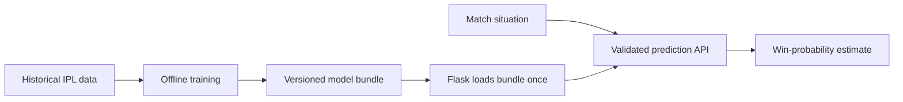

# SMcric

### IPL win-probability estimation with fast Flask inference

[](https://www.python.org/)
[](https://flask.palletsprojects.com/)
[](https://scikit-learn.org/)


SMcric is a machine-learning web application that estimates IPL match outcomes from historical match records and a supplied second-innings situation. It combines a calibrated pre-match classifier with a bounded chase-situation estimate and presents the result through a responsive Flask interface.

The project was designed to demonstrate an end-to-end ML workflow: data preparation, offline training, reusable model serialization, validated REST inference, frontend integration, testing and deployment.

## Highlights

- Analyses more than 1,090 historical IPL matches.
- Loads a complete trained bundle once per server process.
- Produces predictions in approximately 105 ms median local inference time.
- Separates offline training from production inference.
- Validates teams, venue, toss and chase inputs on both client and server.
- Displays win probabilities, required run rate, match context and measured latency.
- Includes responsive homepage and prediction interfaces.
- Provides optional recent-match information through a live-score API.
- Includes automated tests for bundle integrity, validation and inference behaviour.

## How it works



Training is intentionally isolated from the web application:

```text
python train_model.py
        ↓
predictor_bundle.pkl
        ↓ loaded once per process
gunicorn mn:app
        ↓
POST /predict/result → validate → infer → return JSON
```

If the bundle is missing or incompatible, the API returns a controlled `503` response. It does not retrain inside a request, health check or server startup.

## Prediction inputs

| Category | Inputs |
|---|---|
| Match | Team 1, Team 2, city/venue |
| Toss | Toss winner, decision to bat or field |
| Chase | Target, required runs, balls remaining, wickets remaining |

Balls remaining are used instead of decimal overs to avoid cricket-notation ambiguity. For example, `4.3 overs` means four overs and three balls—not 4.3 decimal overs.

## Technology

| Layer | Tools |
|---|---|
| Backend | Python, Flask, Flask-CORS, Gunicorn |
| Machine learning | scikit-learn, Random Forest, probability calibration |
| Data | pandas, NumPy, IPL match dataset |
| Model persistence | joblib |
| Frontend | HTML, CSS, JavaScript |
| Testing | pytest, Flask test client |
| Deployment | Render |

## Project structure

```text
SMcric/
├── mn.py                         # Flask routes and validated inference API
├── predictor.py                  # Training and inference primitives
├── train_model.py                # Offline-only training entry point
├── predictor_bundle.pkl          # Versioned trained inference bundle
├── output2.csv                   # Historical IPL match-level dataset
├── templates/
│   ├── home.html
│   └── predict.html
├── static/
│   ├── css/
│   │   ├── style.css
│   │   ├── effects.css
│   │   ├── predict.css
│   │   └── predict-refinement.css
│   └── js/
│       ├── script.js
│       └── predict.js
├── tests/
│   └── test_prediction.py
├── requirements.txt
├── requirements-dev.txt
├── render.yaml
└── IMPLEMENTATION_NOTES.md
```

## Local setup

### 1. Clone the repository

```bash
git clone https://github.com/manojv74/SMcric.git
cd SMcric
```

### 2. Create a virtual environment

Windows PowerShell:

```powershell
python -m venv .venv
.\.venv\Scripts\Activate.ps1
```

macOS or Linux:

```bash
python3 -m venv .venv
source .venv/bin/activate
```

### 3. Install dependencies

```bash
pip install -r requirements.txt
```

### 4. Start the application

```bash
python mn.py
```

Open https://smcric.onrender.com
## Offline model training

The committed bundle can be used directly. Retrain only after intentionally changing the dataset, features or model configuration:

```bash
python train_model.py
```

Custom paths are supported:

```bash
python train_model.py --data output2.csv --output predictor_bundle.pkl
```

The saved bundle contains:

- Calibrated preprocessing and model pipeline
- Fixed feature order
- Explicit class mapping
- Supported teams, cities and toss decisions
- Schema and model version
- Training timestamp
- Dataset fingerprint
- Chronological holdout metrics

## API

### Prediction

```http
POST /predict/result
Content-Type: application/json
```

Example request:

```json
{
  "team1": "Rajasthan Royals",
  "team2": "Sunrisers Hyderabad",
  "city": "Guwahati",
  "toss_winner": "Sunrisers Hyderabad",
  "toss_decision": "bat",
  "target_runs": 210,
  "required_runs": 50,
  "balls_remaining": 30,
  "wickets_remaining": 3
}
```

Example response shape:

```json
{
  "success": true,
  "prediction": {
    "team1": "Rajasthan Royals",
    "team2": "Sunrisers Hyderabad",
    "team1_probability": 49.47,
    "team2_probability": 50.53,
    "predicted_winner": "Sunrisers Hyderabad"
  },
  "match_context": {
    "required_runs": 50,
    "balls_remaining": 30,
    "wickets_remaining": 3,
    "required_run_rate": 10.0
  },
  "model": {
    "version": "YYYY.MM.DD.HHMM",
    "situation_method": "bounded_chase_estimate_v1"
  },
  "latency_ms": 124.39
}
```

Additional endpoints:

| Method | Endpoint | Purpose |
|---|---|---|
| `GET` | `/` | Homepage |
| `GET` | `/predict` | Prediction interface |
| `GET` | `/dropdown_data` | Supported teams and cities |
| `GET` | `/live_matches` | Optional recent-match data |
| `GET` | `/health` | Application and model readiness |

## Evaluation and performance

The current reproducible evaluation uses the final 20% of matches as a chronological holdout rather than a random split.

| Measurement | Result |
|---|---:|
| Training matches | 872 |
| Test matches | 218 |
| Holdout accuracy | 62.84% |
| Log loss | 0.6823 |
| Brier score | 0.2446 |
| First local inference | 96.34 ms |
| Median of 100 inferences | 105.25 ms |

Timings vary by hardware and deployment load. These measurements are included to document the current implementation honestly and provide a baseline for future model improvements.

## Testing

Install development dependencies and run the test suite:

```bash
pip install -r requirements-dev.txt
pytest -q
```

The tests cover:

- Bundle completeness and compatibility
- Controlled missing-model behaviour
- Probability consistency
- Team and chasing-side mapping
- Invalid team, toss, wicket and ball inputs
- Separation of training from request-time inference
- Offline training output

## Environment variables

| Variable | Required | Description |
|---|---|---|
| `RAPIDAPI_KEY` | Only for live matches | API credential for recent-match information |
| `SMCRIC_MODEL_PATH` | No | Optional custom path to the saved bundle |
| `PORT` | No | Flask port; defaults to `5000` |

Create a local `.env` only if your environment loader supports it. Never commit API keys or secrets.

## Deployment

The repository includes a Render configuration.

```text
Build command: pip install -r requirements.txt
Start command: gunicorn mn:app
Health check: /health
```

Add `RAPIDAPI_KEY` through the hosting provider’s environment settings. The trained `predictor_bundle.pkl` must already be present in the deployment artifact; deployment must not retrain the model.


## Author

**Manoj V**  

[GitHub](https://github.com/manojv74) · [LinkedIn](https://www.linkedin.com/in/manoj-v74/)

